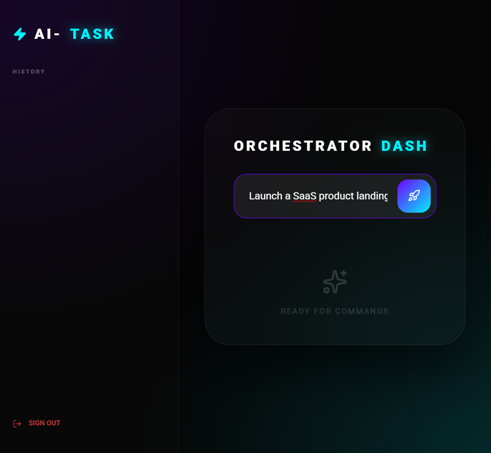

# AI Task Orchestrator

[](https://ai-task-orchestrator-inky.vercel.app/)
[](https://fastapi.tiangolo.com/)
[](https://react.dev/)
[](https://groq.com/)
[](https://www.postgresql.org/)
[](https://www.docker.com/)

**Live:** [ai-task-orchestrator-inky.vercel.app](https://ai-task-orchestrator-inky.vercel.app/) · **Stack:** Next.js/React + FastAPI + PostgreSQL + Groq LLM on Vercel

An AI orchestration product that decomposes a strategic goal into **actionable steps** using **Groq's Llama 3.3**, persists results to Postgres, and ships with a production deploy path.

<p align="center">
  <a href="https://ai-task-orchestrator-inky.vercel.app/">
    
  </a>
  <br/>
  <sub><i>Live "Orchestrator Dash" — enter a goal and generate an executable plan.</i></sub>
</p>

### Architecture

```
React / Next.js dashboard  ──▶  FastAPI  /api  ──▶  Groq LLM (Llama 3.3)
                                    │
                                    ▼
                        SQLAlchemy + Alembic ──▶ PostgreSQL (Neon)
```
Single Vercel deploy — front-end at `/`, FastAPI at `/api/*`. JWT admin auth, secrets in env vars.

## Try it instantly

Open the [live demo](https://ai-task-orchestrator-inky.vercel.app/) — it **auto-starts a demo session** on first visit (no sign-up, no credentials). A scoped token is issued via `POST /auth/demo` and three curated sample plans appear in Recent plans.

Prefer the manual landing? Add `?admin=1` to the URL, or use **“Sign in as admin”**:

| Field | Value |
|-------|-------|
| Email | `admin@example.com` |
| Password | `change-me` |

## Enabling real AI (Groq)

The app degrades gracefully: without a Groq key it returns a **deterministic template plan** (labelled “Template mode” in the UI) so the demo always works. To get live Llama 3.3 output:

1. Get a free key at [console.groq.com](https://console.groq.com/keys).
2. In the **Vercel dashboard → your project → Settings → Environment Variables**, add:
   - `GROQ_API_KEY` = your Groq key (Production + Preview)
   - `GROQ_MODEL` = `llama-3.3-70b-versatile` (optional, this is the default)
3. **Redeploy** (Deployments → ⋯ → Redeploy) so the backend service picks up the new env var.
4. Verify: log in, submit a goal — the badge should read **“AI generated”** instead of “Template mode”.

> On Render, add the same `GROQ_API_KEY` under the API service’s Environment tab and redeploy.

## Live demo
- **Web**: https://ai-task-orchestrator-inky.vercel.app
- **API**: same origin under `/api` (e.g. `/api/health`)

## What's deployed
- **Web**: Next.js 15 + React 19 dashboard (`frontend/`)
- **API**: FastAPI + SQLAlchemy + Alembic (`backend/`)
- **DB**: Postgres (recommended: Neon)

## Health checks
- **API**: `GET /health` → `{"status":"ok"}`
- **Web**: `GET /api/health` → checks backend reachability

## Local development (Docker)
1) Copy env template:

```bash
cp .env.example .env
```

2) Start the stack:

```bash
docker compose up -d --build
```

3) Open:
- **Web**: `http://localhost:3000`
- **API**: `http://localhost:8000`

## Configuration (env vars)
See `.env.example`. Minimum production env vars:
- **API**: `DATABASE_URL`, `JWT_SECRET`, `ADMIN_EMAIL`, `ADMIN_PASSWORD`, `GROQ_API_KEY`
- **Web**: `NEXT_PUBLIC_API_BASE_URL` (and optionally `API_BASE_URL_INTERNAL`)

## Migrations
- The API container runs `alembic upgrade head` on startup.
- To run manually:

```bash
docker compose exec backend alembic -c alembic.ini upgrade head
```

## Production deploy (Vercel Services + Neon)
1) Import repo in Vercel with **Framework Preset: Services** (root `vercel.json`).
2) Create/connect a Neon Postgres database and set env vars:
- `DATABASE_URL` (or Vercel Postgres integration vars)
- `JWT_SECRET`, `ADMIN_EMAIL`, `ADMIN_PASSWORD`, `GROQ_API_KEY`
- `CORS_ORIGINS_CSV`: your Vercel domain(s)
- `NEXT_PUBLIC_API_BASE_URL=/api`
- `API_BASE_URL_INTERNAL=/api` (for `/api/health` route)
3) Verify:
- `GET https://<vercel-app>/api/health`

### Legacy: Render backend (optional)
If using Render for API instead of Vercel serverless:
1) Create a Neon Postgres database and copy the connection string.
2) Create a new Render **Web Service** from this GitHub repo (Blueprint supported via `render.yaml`).
3) Set env vars on Render:
- `DATABASE_URL`: Neon connection string
- `JWT_SECRET`: strong random value
- `ADMIN_EMAIL`, `ADMIN_PASSWORD`: admin credentials
- `GROQ_API_KEY`: your Groq API key
- `CORS_ORIGINS_CSV`: allowed web origins (ex: `https://<your-vercel-domain>`)
4) Verify:
- `GET https://<render-service>/health`

## Security notes
- **No secrets are committed**. Configure via platform env vars.
- If you ever committed an API key, rotate it in your provider dashboard.
